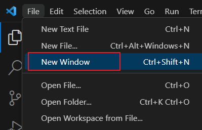
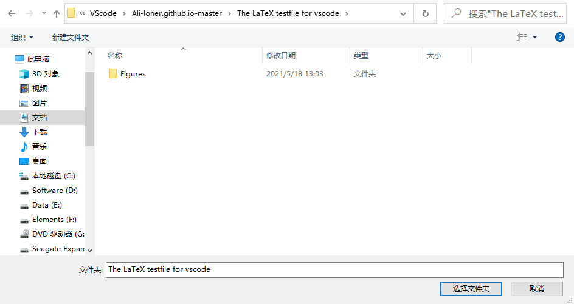
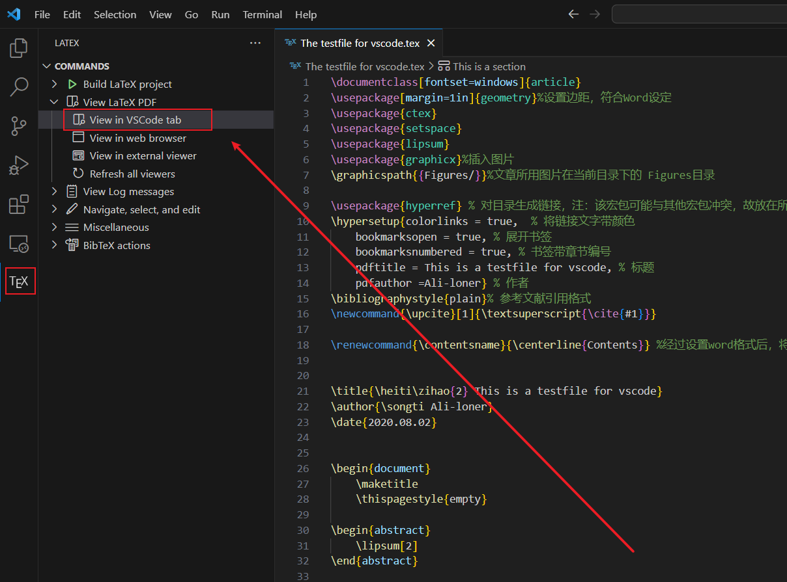
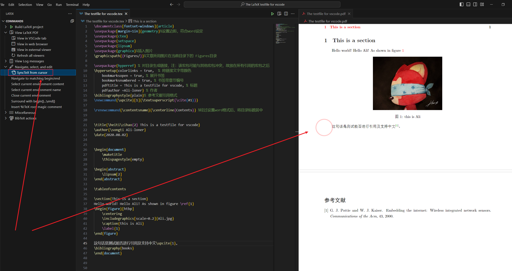

### 本文参考教程


>
> https://zhuanlan.zhihu.com/p/166523064
> 


### 具体步骤

#### 1 TeX Live 下载与安装

>
> 1. 进入网址 ：https://tug.org/texlive/acquire-iso.html
>
> > 进入 ISO 下载页面，点击图示红框圈画位置进入随机的镜像网站。
> 
> > <div align=center>
> > 
> > </div> 
> 
> 2. 可以看到的是，笔者进入了南京大学镜像网站，点击红框圈画链接进行 TeX Live 下载。
>
> https://mirrors.nju.edu.cn/CTAN/systems/texlive/Images/
> 
> > <div align=center>
> > 
> > </div> 
> > 
> > 要等10min
> > 
> > <div align=center>
> > 
> > 
> > </div> 
> 
> 3. 右键，在打开方式中选择“Windows 资源管理器"打开
> 
> > <div align=center>
> > 
> > 
> > </div> 
> 
> 
> 4. 找到 "`install-tl-windows`" 文件，为了后面不必要的麻烦，右键以管理员身份运行
> 
> > <div align=center>
> > 
> > </div> 
> 
> 
> 
> 5. 等一会，出现下图后，需要进行路径的更改。由于 TeX Live 自带的 TeXworks 不怎么好用，并且此文主要将 vscode 作为 LaTeX 的编辑器，故而取消 安装 TeXworks 前端的选项，再点击安装
> 
> > <div align=center>
> > 
> > </div> 
> 
> 
> 6. 当出现下图所示弹窗时，说明安装完毕，点击关闭即可。
>
> > <div align=center>
> > 
> > </div> 
> 
> 7. 检查安装是否正常： 按 `win + R` 打开运行，输入`cmd`，打开命令行窗口；然后输入命令`xelatex -v` ，如下图
>
> > <div align=center>
> > 
> > </div> 
> > 
> > 如上图所示，若输出了一些版本信息，则安装正常。
> > 
> > 
>
> 


#### 2 vscode 下载与安装


#### 3 vscode 中文语言环境配置


#### 4 LaTeX的支持插件 LaTeX Workshop安装


>
> 1. 点击 `Extensions` 图标，打开拓展；
>
> > <div align=center>
> > 
> > </div> 
> 
> 
> 2. 输入"`latex workshop`"，选择第一个LaTeX Workshop插件；
>
> > <div align=center>
> > 
> > </div> 
>  
> 3. 点击"`install`"进行安装，等待安装完成；
>
> 
> 


#### 5 打开LaTeX环境设置页面


>  
> 1. 点击设置图标
>
> > <div align=center>
> > 
> > </div> 
>  
> 2. 转到 UI 设置页面
>
> > <div align=center>
> > 
> > </div> 
>  
> 3. 点击下图中红框处，打开 json 文件，进入代码设置页面
>
> > <div align=center>
> > 
> > 
> > </div> 
>  
> UI 设置页面和JSON设置页面均为设置页面，其功能是一样的。不同的是，UI 设置页面交互能力较强，但一些设置需要去寻找，比较麻烦；而JSON设置页面虽然相对 UI 而言不那么直观，但却可以对自己想要的功能直接进行代码编写，且代码设置可以直接克隆别人的代码到自己的编辑器中，从而直接完成相应设置，比较便捷。
> 
>  
> 


#### 6 LaTeX环境的代码配置

##### 6.1 LaTeX配置代码展示

>
> 原有的是markdown的配置，不要动
> 
> ```json
> {
>     "markdown-preview-enhanced.previewTheme": "monokai.css",
>     "files.autoSave": "afterDelay",
>     "remote.SSH.remotePlatform": {
>         "43.142.243.134": "linux"
>     },
>     "markdown-preview-enhanced.codeBlockTheme": "monokai.css"
> }
> ```
> 
> 配置代码如下（不包含外部 pdf 查看器设置）：
> 
> 

```json
{
    "markdown-preview-enhanced.previewTheme": "monokai.css",
    "files.autoSave": "afterDelay",
    "remote.SSH.remotePlatform": {
        "43.142.243.134": "linux"
    },
    "markdown-preview-enhanced.codeBlockTheme": "monokai.css",


    // 自动编译
    "latex-workshop.latex.autoBuild.run": "onFileChange", // "onFileChange"在文件更改时自动编译；"never"从不自动编译
    // 右键菜单
    "latex-workshop.showContextMenu": true,
    // 从使用的包中自动补全命令和环境
    "latex-workshop.intellisense.package.enabled": true,
    // 编译出错时设置是否弹出气泡设置：显示错误
    "latex-workshop.message.error.show": false,
    // 编译出错时设置是否弹出气泡设置：显示警告
    "latex-workshop.message.warning.show": false,
    // 编译工具和命令
    "latex-workshop.latex.tools": [
        {
            "name": "xelatex",
            "command": "xelatex",
            "args": [
                "-synctex=1",
                "-interaction=nonstopmode",
                "-file-line-error",
                "%DOCFILE%"
            ]
        },
        {
            "name": "pdflatex",
            "command": "pdflatex",
            "args": [
                "-synctex=1",
                "-interaction=nonstopmode",
                "-file-line-error",
                "%DOCFILE%"
            ]
        },
        {
            "name": "latexmk",
            "command": "latexmk",
            "args": [
                "-synctex=1",
                "-interaction=nonstopmode",
                "-file-line-error",
                "-pdf",
                "-outdir=%OUTDIR%",
                "%DOCFILE%"
            ]
        },
        {
            "name": "bibtex",
            "command": "bibtex",
            "args": [
                "%DOCFILE%"
            ]
        }
    ],
    // 用于配置编译链
    "latex-workshop.latex.recipes": [
        {
            "name": "XeLaTeX",
            "tools": [
                "xelatex"
            ]
        },
        {
            "name": "PDFLaTeX",
            "tools": [
                "pdflatex"
            ]
        },
        {
            "name": "BibTeX",
            "tools": [
                "bibtex"
            ]
        },
        {
            "name": "LaTeXmk",
            "tools": [
                "latexmk"
            ]
        },
        {
            "name": "xelatex -> bibtex -> xelatex*2",
            "tools": [
                "xelatex",
                "bibtex",
                "xelatex",
                "xelatex"
            ]
        },
        {
            "name": "pdflatex -> bibtex -> pdflatex*2",
            "tools": [
                "pdflatex",
                "bibtex",
                "pdflatex",
                "pdflatex"
            ]
        },
    ],
    // 文件清理。此属性必须是字符串数组
    "latex-workshop.latex.clean.fileTypes": [
        "*.aux",
        "*.bbl",
        "*.blg",
        "*.idx",
        "*.ind",
        "*.lof",
        "*.lot",
        "*.out",
        "*.toc",
        "*.acn",
        "*.acr",
        "*.alg",
        "*.glg",
        "*.glo",
        "*.gls",
        "*.ist",
        "*.fls",
        "*.log",
        "*.fdb_latexmk"
    ],
    // 构建失败后自动清除
    "latex-workshop.latex.autoClean.run": "onFailed", // "onFaild"在构建失败后清除辅助文件；"onBuilt"编译后自动清理无用文件
    // 使用上次的recipe编译组合
    "latex-workshop.latex.recipe.default": "lastUsed",
    // 用于反向同步的内部查看器的键绑定。ctrl/cmd +点击(默认)或双击
    "latex-workshop.view.pdf.internal.synctex.keybinding": "double-click"
}
```
>  
> 
> 
> 若您不想要配置外部查看器以及了解内部查看和外部查看之间切换操作，可以直接复制上述代码至 json 文件中，即可完成 LaTeX 的配置，从而可以对 LaTeX 代码进行编译。
>
> 
> 根据 `json` 文件编写规则，每个代码语句（除了代码块儿最后一句）都需要加上英文状态下的 `,`，否则就会报错；而每个代码块儿的最后一句是不需要加上 `,` 的。从上文整个代码块儿可以看出此规则。
> 
> 如果您日后需要在上述代码之后再添加其他代码，请记得在最后一句
> 
> ```json
> "latex-workshop.view.pdf.internal.synctex.keybinding": "double-click"
> ```
> 
> 后添加上`,`，即变为 
> 
> ```json
> "latex-workshop.view.pdf.internal.synctex.keybinding": "double-click",
> ......
> ```
>
> 其中的`......`为您添加的其余代码。
>
> 切记！
>
> 
> 


##### 6.2 LaTeX配置代码解读


#### 7 tex文件编译


##### 7.1 tex测试文件下载

>
> 为了测试 vscode 功能是否比较完整，笔者编写了一份简单的 tex 文件，以此测试其是否支持中英文，能否编译目录，能否插入图片，能否进行引用，能否编译参考文献（编译bixtex文件）等功能。
> 
>
> 测试所用的 tex 文件可以从 github 下载：
> 
>
> https://github.com/Ali-loner/Ali-loner.github.io
>
>
> > <div align=center>
> > 
> > </div> 
>  
> 
> 


##### 7.2 tex 测试文件编译

> 
> 1. 打开测试文件所在文件夹
>
> > <div align=center>
> > 
> > 
> > 
> > 
> > </div> 
>  
> 2. 点击选中 `.tex` 文件，进行文件内容查看
>
>
> > <div align=center>
> > 
> > </div> 
>  
> 
> 3. 开始编译文件。 由于进行测试的文件中涉及参考文献的引用（`.bib`的编译），故而选择`xelatex -> bibtex -> xelatex*2`编译链。
>
> > 为了更方便进行编译，可对其设置快捷键，设置快捷键步骤如下：
> > 
> > 鼠标点击`左下角齿轮`，选择`Keyboard Shortcuts`，在弹出的界面搜索栏中输入`recipe`，如下图所示。双击检索到的快捷键修改栏，同时按下`Ctrl+Alt+R`，编译快捷键则设置完成。
> > 
> > <div align=center>
> > 
> > 
> > 
> > </div> 
> >  
> > 选中tex文件的代码页面（若未选中，则无法进行编译），然后按下该快捷键，在编辑器页面上端进行编译链选择，如下图：
> > 
> > <div align=center>
> > 
> > </div> 
> > 
>
> 4. 编译成功
>
> > 当发现页面下方出现 √ 符号时，说明编译成功，相反，如果出现 × 符号，说明编译失败，就要找失败原因了。
> > 
> > <div align=center>
> > 
> > 
> > </div>  
> > 
> > 
> > a. 左侧工具栏
> > 
> > 当编译成功后，选中 tex 文件中任意的代码，以此来选中 tex 文件，然后进行图示操作。其中侧边栏所展现的就是上文提及的新的 LaTeX 标记。
> > 
> > <div align=center>
> > 
> > 
> > </div>  
> > 
> 
> 
> 5. 正向同步测试，即从代码定位到 pdf 页面相应位置。有以下三种方法：
> > 
> > a. 使用侧边工具栏
> > 
> > <div align=center>
> > 
> > </div>  
> > 
> > b. 使用右键菜单
> > 
> > <div align=center>
> > 
> > </div>  
> > 
> > c. 使用快捷键
> > 
> > 选中需要跳转的代码所在行，按`Ctrl+Alt+J`，右侧就会跳转到相应行。这里的快捷键为默认设置，可自行通过上文方式设置为您想要的快捷键。
> > 
> 
> 
> 6. 反向同步测试,即从 pdf 页面定位到代码相应位置
> 
> > 
> > 在编译生成的 pdf 上，选中想要跳转行，鼠标左键`双击`或`ctrl+鼠标左键单击`，跳转到对应代码。此处快捷键的选择为上文设置，若使用笔者的代码，则为鼠标左键双击。
> > 
> 
> 
> 


