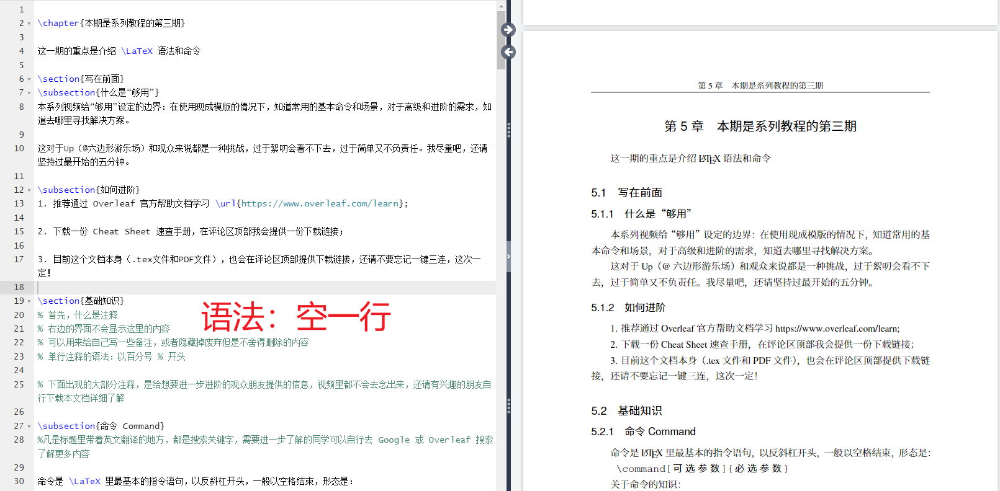

### 如果overlea编译超时怎么办?

> 主要是因为图片太多了，不能和文本、表格放在一起渲染。
>
> 我们先渲染除了图片以外的内容
> 
> 1. 先用 `Fast [draft]`
> 
> <div align=center>
> 
>  
> </div> 
> 
> 然后渲染图片
> 
> 2. 后用 `Normal`
> 
> <div align=center>
> 
> 
> </div> 
> 
> 
> 
> 


### 网址、账户

>
> https://www.overleaf.com/
>
> https://cn.overleaf.com/project
>
> 账户：google账号
>
> 


### 入门教程

> 
> bilibili：https://www.bilibili.com/video/BV1aN4y1K7qy
>
> 飞书云文档：https://xyfamily.feishu.cn/docx/MuhFdGc1lovo84xoq6pcScTSnbb
>
> Overleaf 帮助文档（强烈推荐）https://www.overleaf.com/learn
>
> LaTeX Cheatsheet 速查手册 `.\material\LaTeX Cheatsheet.pdf`
> 
> <font color="gree"> 本人所学内容，对应Project的压缩包为 `.\material\初学（基于清华大学模板）.zip`  </font>
> 


#### LaTeX 从入门到够用（1）为什么应该用它写论文

> 
> <font color="gree"> 1. 内容和格式完全隔离  </font>
>
> 
> <font color="gree"> 2. 数学公式使用纯文本方式撰写  </font>
>
> 
> <font color="gree"> 3. 引用和修改参考文献很方便  </font>
>


#### LaTeX 从入门到够用（2）Overleaf 的使用

> 
> 客户端下载：https://www.latex-project.org/get/
> 
> 但是不建议本地部署，对新手不友好，而且有了`overleaf`没必要
> 
> 
> <font color="pink">（1）如何获取模板 </font>
> 
> > 中国科学院大学模板（非官方）：https://www.overleaf.com/latex/templates/ucasthesis/ktbzrphwzfjb
> > 
> > 清华大学模板：https://www.overleaf.com/latex/templates/thuthesis-tsinghua-university-thesis-latex-template/cfwgcxtvkbsx
> > 
> > <div align=center>
> > 
> > 
> > 
> > </div> 
> > 
> > 点击`Open as Template`，默认把此模板复制到账号中
> > 
> > <div align=center>
> > 
> > </div> 
> > 
> 
> 
> <font color="pink">（2）页面结构 </font>
> 
> > <font color="gree">
> > 
> > 左上角：文件结构树
> > 
> > 左下角：文章层级结构、大纲
> > 
> > 中间：纯文本
> > 
> > 右侧：编译结果、错误语句
> > 
> > </font>
> > 
> > <div align=center>
> > 
> > 
> > </div> 
> > 
> > 
> 
> 
> <font color="pink">（3）在模板基础上撰写 </font>
> 
> > 文件结构树大部分是设置文章样式，需要修改的极少
> > 
> > 我们只需要在 `data、figures、ref` 文件夹中添加内容就行
> > 
> > <div align=center>
> > 
> > </div> 
> > 
> > `data：包含论文每一页`
> > 
> > `figures：存放图像，方便后期调整和修改`
> > 
> > `ref：集中管理参考文献`
> > 
> > 
> > <font color="gree"> 例如，如果想要修改摘要，就是修改`data\abstract.tex` </font>
> > 
> > > <div align=center>
> > > 
> > > 
> > > </div> 
> > 
> > 
> > <font color="gree"> 例如，如果想要添加图片，就是`Upload 到 figures 文件夹` </font>
> > 
> > > <div align=center>
> > > 
> > > 
> > > </div> 
> >  
> > 
> > <font color="gree"> 例如，如果想要修改参考文献，就是修改`ref\refs.bib`</font>
> > 
> > > <div align=center>
> > > 
> > > </div> 
> >  
> > 
> 
> 
> <font color="pink">（4）论文封面如何修改 </font>
> 
> > `98%` 的内容，只需要通过修改 `data、figures、ref` 文件夹就行
> > 
> > `1%` 的内容，即论文标题等，对于清华大学模板，需要修改 `thusetup.tex`
> > 
> > > <div align=center>
> > > 
> > > </div> 
> >  
>
> 
> 
> <font color="pink">（5）论文章节如何添加 </font>
>
> >  模板中只有4个章节 `ch01、ch02、ch03、ch04`，如何我们需要 `ch05` 呢？
> > 
> > `1%` 的内容，即论文结构、目录树等，对于清华大学模板，需要修改 `文档结构定义文件 thuthesis-example.tex`
> > 
> > > <div align=center>
> > > 
> > > </div> 
> > 
> > * `data`中添加`data\chap05.tex`
> > 
> > * 打开`thuthesis-example.te`, 修改 `% 正文部分`, 实现增加章节的效果
> > 
> > > <div align=center>
> > > 
> > > </div> 
> > 
> 
> 
> 
> 
> <font color="pink">（4）其他模板呢？ </font>
> 
> > 
> > <font color="yellow"> 
> > 
> > 即使是其他模板，我们也只需要关注 `.tex` 文件，这是需要我们自行编辑的文件
> > 
> > 想要快速找到文档结构定义文件，可以通过 `Menu` 中的 `Main document` 找到，默认的就是定义文档结构的文件
> > 
> > <div align=center>
> > 
> > </div> 
> > 
> >  </font>
> > 
> > 
> 
> 
> 


#### LaTeX 从入门到够用（3）语法和常用命令（上）

> 
> 飞书云文档：https://xyfamily.feishu.cn/docx/MuhFdGc1lovo84xoq6pcScTSnbb
>
> Overleaf 帮助文档（强烈推荐）https://www.overleaf.com/learn
>
> LaTeX Cheatsheet 速查手册 `.\material\LaTeX Cheatsheet.pdf`
> 
> 第三期视频（上和下）中所涉及的 .tex 源文件 `.\material\六边形游乐场.tex`
> 
> 第三期视频（上和下）中所涉及的 PDF 文件 `.\material\六边形Up演示文档.pdf`
> 


> 
> <font color="gree"> 在清华大学模板的基础上，添加`data\chap05.tex`，内容从`六边形游乐场.tex`复制 </font>
> 
> > <div align=center>
> > 
> > </div> 
> 
> 
> <font color="gree"> 修改 `文档结构定义文件 thuthesis-example.tex` </font>
> 
> > <div align=center>
> > 
> > </div> 
> 
> 
> 
> 


> 
> 
> <font color="pink">（1） 注释  </font>
> 
> > 
> > `%` 开头的文字不会显示在右侧编译
> > 
> > ```latex
> > % 首先，什么是注释
> > % 右边的界面不会显示这里的内容
> > % 可以用来给自己写一些备注，或者隐藏掉废弃但是不舍得删除的内容
> > % 单行注释的语法：以百分号 % 开头
> > ```
> 
> <font color="pink">（2） 命令  </font>
> 
> > 编译器自动标出的蓝色部分，以反斜杠 `\`开头，以一个空格结束（还有其他方式）
> > 
> > <div align=center>
> > 
> > </div> 
> > 
> > <font color="gree"> 命令和文字混排时，要记得：每次命令结束之后，给一个空格 </font>
> > 
> > ```latex
> > 命令是 LaTeX 里最基本的指令语句，以反斜杠开头，一般以空格结束，形态是：
> > 
> > \begin{verbatim}
> >     \command[可选参数]{必选参数}
> > \end{verbatim}
> > 
> > 关于命令的知识：
> > 0. 命令区分大小写； 
> > 1. 有些命令可以没有任何参数，比如说 \LaTeX；
> > 2. 如果一个命令有可选参数（不论有几个），都应该被写在[和]之间；
> > 3. 如果一个命令有必选参数（不论有几个），都应该被写在\{和\}之间。
> > ```
> > 
> > ```latex
> > 展示命令的两种方式（一般不用）
> > 1. 使用 verbatim 环境，上面已经用到了。
> > 2. 使用 \verb|| 命令，一般用在行内命令展示，例如 \verb|\item|
> > ```
> > 
> > <div align=center>
> > 
> > </div> 
> > 
> 
> 
> <font color="pink">（3） 分段  </font>
> 
> > 代码中经常有空一行的情况，意思是重新分段
> >  
> > LaTeX 默认每段缩进
> > 
> > 当然对于有序列表来说，后续有更好的方式处理
> > 
> > <div align=center>
> > 
> > </div> 
> > 
> > 
> 
> <font color="pink">（4）段内换行 </font>
> 
> > ```latex
> > 分段和换行是不一样的（可以从上面是否缩进看出来）
> > 1. 空一行 和 \par 命令是分一段
> > 2. \\ 和 \newline 命令是换一行
> > ```
> >  
> 
> 
> <font color="pink">（5）环境 </font>
> 
> > 
> > ```latex
> > 环境指被 \begin 和 \end 命令包围的空间，提供了相对独立的命令作用范围
> > 
> > 
> > 格式
> > \begin{环境名}
> >     ...
> > \end{环境名}
> > 
> > 环境演示：
> > \begin{verbatim}
> >     1. 这里就是 verbatim 环境里面
> >     2. 环境里的内容会收到这个环境的影响
> > \end{verbatim}
> > ```
> > 
> > <div align=center>
> > 
> > </div> 
> > 
> 
> 
> 
> 
> <font color="pink">（6）包 </font>
> 
> > ```latex
> > LaTeX 本体包含了一些命令，
> > 
> > 但考虑到 LaTeX 被学术界广泛的使用， 需求多种多样，内置的命令很难满足所有的情况。
> > 
> > 因此，有了包的概念，每一个包都会提供很多新的命令。
> > 
> > 目前 LaTeX 生态有超过4000种的各种宏包，可以根据需要引入到你的文档里。
> > 
> > 一会我们下面插入图片的操作中，也会使用到特定的包。
> > 
> > \usepackage{graphicx}
> > ```
> > 
> > 除了 `Package` 以外，还有一种叫做 `Class` 的文件，可以按需进一步了解
> > 
> 
> 
> <font color="pink">（7）代码结构 </font>
> 
> > ```latex
> > \subsection{代码结构}
> > 一份 \LaTeX 代码（也就是左侧这边的代码），分为两大部分：导言和正文
> > 
> > 所有文档的完整代码，都应该有这两个部分
> >     \documentclass{article}
> > 
> >     \begin{document}
> >       This is a simple example
> >     \end{document}
> > 
> > “导言”区域以 \documentclass{} 开始，以 \begin{document} 结束
> > “正文”区域以 \begin{document} 开始，以 \end{document} 结束
> > 
> > “导言” (Preamble) 区域里面可以放一些文档需要引用的外部包; 
> > “正文”区域实际上就是一个 document 大环境，绝大部分内容在这里面发生。 
> > ```
> > 
> > 我们查看 `thuthesis-example.tex` ，恰好就是这样
> > 
> > ```latex
> > % !TeX encoding = UTF-8
> > % !TeX program = xelatex
> > % !TeX spellcheck = en_US
> > 
> > \documentclass[degree=master]{thuthesis}
> > 
> > ...
> > 
> > % 论文基本配置，加载宏包等全局配置
> > \input{thusetup}
> > 
> > \begin{document}
> > 
> > ...
> > 
> > \end{document}
> > ```
> > 
> 
> 
> <font color="pink">（8）文档结构 </font>
> 
> > 
> > ```latex
> > \part{}= 篇(最高级)
> > \chapter{}= 章（第二级）
> > \section{}= 节（第三级）
> > \subsection{}= 小节（第四级） 
> > \subsubsection{}= 小小节（第五级）
> > 
> > 如果 \subsubsection 无法出现在目录里面，说明是模板设置的原因，可以自己去调整
> > 
> > 还有 \paragraph 和 \subparagraph 不做进一步展开
> > ```
> > 
> 
> 
> <font color="pink">（9）列表 </font>
> 
> > 除了控制文档结构的语句外，对我来说，第二常用的就是各种类型的列表。
> > 
> > ```latex
> > 首先，我们展示一下 \textbf{无序列表}：
> > 使用 itemize 环境开启无序列表，使用 \item 命令增加列表项。
> > 
> > \begin{itemize}
> >     \item 这是第一项
> >     \item 这是第二项
> >     \item 基本上你可以有任意多个项
> >     \item 你还可以嵌套，比如说
> >     \begin{itemize}
> >         \item 这是一个嵌套的无序列表
> >         \item 还可以继续嵌套，我们就不演示了
> >     \end{itemize}
> > \end{itemize}
> > ```
> > 
> > <div align=center>
> > 
> > </div> 
> >  
> > 
> > ```latex
> > 其次，我们展示一下 \textbf{有序列表}的使用：
> > 使用 enumerate 环境开启无序列表，使用 \verb|\item| 命令增加列表项
> > 
> > \begin{enumerate}
> >     \item 这是第一项
> >     \item 这是第二项
> >     \item 同样可以嵌套，方法和上面类似就不演示了
> >     \item 有序和无序列表之间也可以相互嵌套
> > \end{enumerate}
> > ```
> > 
> > <div align=center>
> > 
> > </div> 
> >  
> >  
> > 
> > ```latex
> > \textbf{知识点}：
> > \begin{itemize}
> >     \item 列表里可以嵌套列表，还可以在两种类型列表之前相互嵌套，最多支持四层嵌套
> >     \item 列表项的序号其实是可以自定义的：使用 \item[] 代替 \item，就可以自定义你喜欢样式，比如说
> >         \begin{enumerate}
> >             \item[第一] 这是一项
> >             \item[第二] 这是一项
> >         \end{enumerate}
> > \end{itemize}
> > ```
> > 
> > 
> > <div align=center>
> > 
> > </div> 
> > 
> > 
> > ```latex
> > 更多小知识
> > 如果想自行定义整个列表对的序号呈现方式，可以在列表环境外面加参数，比如 \begin{itemize}[label=-]
> > 如果有自己常用的序号方式，还可以通过 \newlist 命名自定义列表环境
> > ```
> > 
> 
> 
> 
> 
> <font color="pink">（10）图片 </font>
> 
> > 
> > ```latex
> > 对于插入图片的操作，有两个准备工作：
> > 
> > 首先，需要在文档的导言区域使用命令 \usepackage{graphicx} 加载宏包；
> > 其次，（最好）在导言区域通过命令 \graphicspath{path} 告诉 LaTeX  本文档中图片所在文件夹的路径。
> > 比如在当前文档中，我们设置了图片路径为 \graphicspath{{figures/}}
> > ```
> > 
> > ```latex
> > 那么具体怎么插入图片呢？
> > 使用命令 \includegraphics{文件地址}
> > 
> > 效果示意：
> > \includegraphics[width=\textwidth]{figures/ROG.jpg} 
> > 
> > 可选参数 [width=\textwidth] 的增加，是为了控制图片的宽度（让 图片宽度 和 页面宽度 实现等宽）
> > 可以通过各种参数的控制调整图片的长宽等
> > 还可以旋转、裁切之类的
> > ```
> > 
> > <div align=center>
> > 
> > </div> 
> > 
> > 
> > ```latex
> > 除了像刚才这样直接插入图片，更常见的，考虑到需要对图片进行很多的格式设置，
> > 以及我们需要 LaTeX 帮助给图片增加合适的序号，所以最好创建一个 figure 环境，
> > 然后在环境里使用命令插入图片，代码和效果如图 
> > 
> > \ref{fig:hex}：\par 
> > 
> > \begin{figure}
> >     \centering
> >     \includegraphics[width=\textwidth]{figures/ROG.jpg} 
> >     \caption{欢迎关注我的账号} % 添加标题
> >     \label{fig:hex} % 添加标签，将默认已经生成的文件序号回填到引用的地方
> > \end{figure}
> > 
> > 使用 figure 环境可以让 LaTeX 帮我们自动生成图片序号
> > \includegraphices 命令中不加.jpg等后缀也可以，LaTeX 会按照不同后缀搜索整个文件夹。
> > 所以如果有同名文件，会按照一定规则选取和匹配。
> > 
> > 
> > \ref和\label是用于交叉引用的命令
> > 使用 \label 命令可以为某个对象（如章节、图表、公式等）设置一个标签，
> > 而使用 \ref 命令可以引用该标签所对应的对象。
> > 
> > 关于使用 \LaTeX 内置命令和环境进行绘图，也作为进阶知识，感兴趣的同学可自行搜索学习。
> > 
> > % 另外，实际上有一个重要的概念叫做浮动元素
> > ```
> > 
> > <div align=center>
> > 
> > </div> 
> > 
> > 
> > 
> 
> 
> 
> <font color="pink">（11）表格 </font>
> 
> > 
> > ```latex
> > LaTeX 内置的最基本的表格环境是 tabular，但是非常不好用，所以完全不建议，我们简单演示一下：
> > 
> > \begin{tabular}{c|c}
> >      第一行第一列&第一行第二列  \\
> >      第二行第一列&第二行第二列 
> > \end{tabular}
> > 
> > 表格里面的 \\ 用来在表格里面换行
> > 表格头部的必选参数 {c|c}中，两个c代表两列
> > 更多细节不再展开，有兴趣可以自行搜索，不过综合来说，不建议使用默认的表格
> > ```
> > 
> > <div align=center>
> > 
> > </div> 
> > 
> > ```latex
> > % 对于新人友好的方式如下：
> > 
> > 由于表格，是一个看上去简单、但实际使用过程中事情很多的东西，
> > 比如说列宽的设置、合并单元格、各种表格框线的绘制等等，所以使用 LaTeX 原生的命令绘制好复杂表格的难度过大。
> > 
> > 因此，最好是使用各种在线 LaTeX 表格生成器，它们一般都支持你直接上传 Excel 表格，帮你在线转换，
> > 也可以在线填写内容生产 LaTeX 语法的表格。
> > 
> > 比如，网页 \url{https://www.tablesgenerator.com/} 提供的工具，如图~\ref{fig:tableTool} 。
> > 
> > \begin{figure}[ht]
> >     \centering
> >     \includegraphics[width=\textwidth]{figures/Table_Generator.png}
> >     \caption{在线生成表格的工具举例}
> >     \label{fig:tableTool}
> > \end{figure}
> > ```
> > 
> > https://www.tablesgenerator.com/
> > 
> > <div align=center>
> > 
> > </div> 
> > 
> 
> 
> 
> <font color="pink">（12）数学 </font>
>
> > https://www.latexlive.com/
> > 
> > https://mathpix.com/
> > 
> > ```latex
> > 数学公式的 LaTeX 的最擅长的领域，不仅可以非常方便的撰写出来各种数学公式，
> > 最最重要的是可以很好的被自动排版进论文里面，美观大方。
> > 
> > 数学方面，一般涉及数学符号和单位、数学公式、数学定理三部分内容。
> > * 数学符号和单位涉及国内外或者不同目的的不同标准，最好跟着模版来
> > * 数学公式设计行业公式、行间公式等
> > * 数学定理主要是样式
> > 
> > 由于以上的这些情况，数学相关的宏包和命令非常多，不过考虑到我们本系列视频的主题“从入门到够用”，
> > 这一块我们就不做进一步展开了。而是推荐新人使用在线的可视化工具。
> > 
> > 一个简单的效果演示：
> > \begin{align}
> >   a & = b + c + d + e \\
> >     & = f + g
> > \end{align}
> > 
> > 公式常见的环境包括 equation, align 等
> > 定理常见的宏包和环境包括 amsthm, thoerem 等
> > ```
> > 
> > <div align=center>
> > 
> > </div> 
> > 
> > ```latex
> > 像表格的处理一样，有需要插入数学公式的同学可以使用一些在线工具，
> > 比如，网页 \url{https://www.latexlive.com/} 提供的工具，如图~\ref{fig:mathTool} 。
> > 
> > \begin{figure}[ht]
> >     \centering
> >     \includegraphics[width=\textwidth]{figures/latexlive.png}
> >     \caption{在线生成数学公式的工具举例}
> >     \label{fig:mathTool}
> > \end{figure}
> > ```
> > 
> > <div align=center>
> > 
> > </div> 
> > 
> > ```latex
> > 还有一些工具，可以直接识别你拍的照片或者手写的公式，
> > 比如，网页 \url{https://mathpix.com/} 提供的工具,如图~\ref{fig:handwriteTool} 。
> > 
> > \begin{figure}[ht]
> >     \centering
> >     \includegraphics[width=\textwidth]{figures/mathpix.png}
> >     \caption{在线生成数学公式的工具举例}
> >     \label{fig:handwriteTool}
> > \end{figure}
> > ```
> > 
> > <div align=center>
> > 
> > </div> 
> > 
> 
> 
> 
> <font color="pink">（13）脚注 </font>
> 
> > 
> > ```latex
> > 这部分就轻松愉快了，是一个我非常喜欢的小功能，但是很方便。可以在文档中的任意位置增加脚注，
> > 比如说这里 \footnote{括号里写的内容都会被添加到页面底部，不论这个段落被各种图表挤到了哪一页}
> > 
> > 具体的命令是 \footnote{}
> > 
> > 当然也可以通过可选参数自定义脚注的编号
> > ```
> > 
> > <div align=center>
> > 
> > </div> 
> > 
> 
> 
> <font color="pink">（14）引用 </font>
> 
> > 
> > ```latex
> > 引用也非常的简单，在任意需要添加引用的位置，
> > 比如这里 \cite{zhangkun1994}，使用命令 \cite{}（花括号里填写引文信息）
> > 
> > 当然，前提是你已经把引用的来源，添加到了 .bib 文件中。
> > 
> > 我们打开 ref\refs.bib 文件
> > 
> > @article{zhangkun1994,
> >   author     = {张昆 and 冯立群 and 余昌钰 and others},
> >   title      = {机器人柔性手腕的球面齿轮设计研究},
> >   journal    = {清华大学学报: 自然科学版},
> >   volume     = {34},
> >   number     = {2},
> >   pages      = {1--7},
> >   year       = {1994},
> >   key        = {zhang1 kun1},
> > }
> > 
> > 如何获得 BibTeX 的内容？
> > 以后有空我会介绍一下如何在 Zotero 中直接获取这个信息以及如何使用 Zotero 进行文献管理
> > ```
> > 
> > <div align=center>
> > 
> > </div> 
> > 
> 
> 
> <font color="pink">（15）常用符号 </font>
> 
> > 
> > ```latex
> > 以下是一些可能会用到的常用符号：
> > 
> > 单引号 `和'，分别是左单引号‘ 和 右单引号’
> > 双引号 ``和"，分别是左双引号“ 和 右双引号”
> > LaTeX 符号 \LaTeX,效果是一个美观的 LaTeX 符号  
> > 省略号 \dots,效果是一个常见的省略号 ...
> > ```
> > 
> > <div align=center>
> > 
> > </div> 
> > 
> 
> <font color="pink">（16）文字样式 </font>
> 
> > 
> > ```latex
> > 加粗 \textbf{}
> > 下划线 \underline{}
> > 斜体 \textit{}
> > ```
> > 
> > <div align=center>
> > 
> > </div> 
> > 
> 
> 
> 


